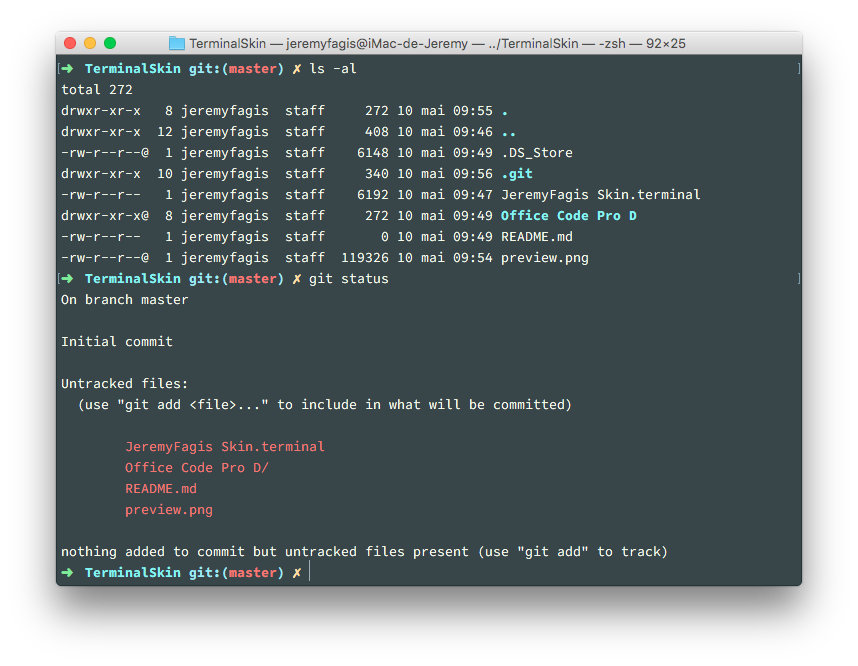

# Skin for Terminal.app

## Usage

1. Download this repo.
2. Install font **Office Code Pro D**
3. Open up Terminal, go to **Preferences**, then **Profiles**.
4. In the bottom left, click the settings cog and select **Import...**. Navigate to the download file and open it.
5. Lastly, set it as your default by selecting the new profile and clicking the **Default** button.